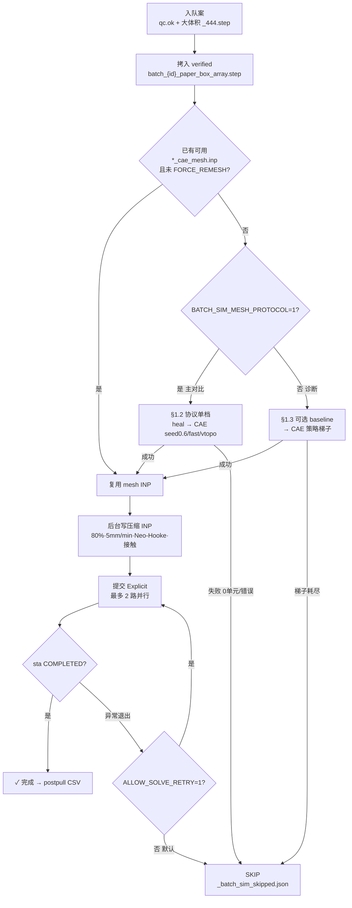
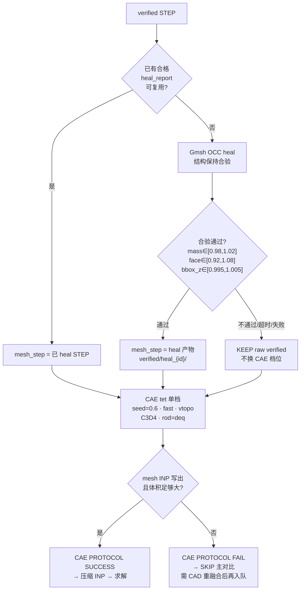
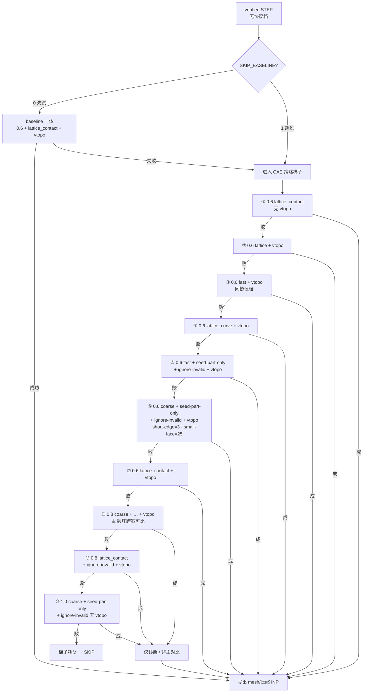
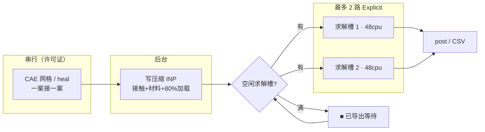
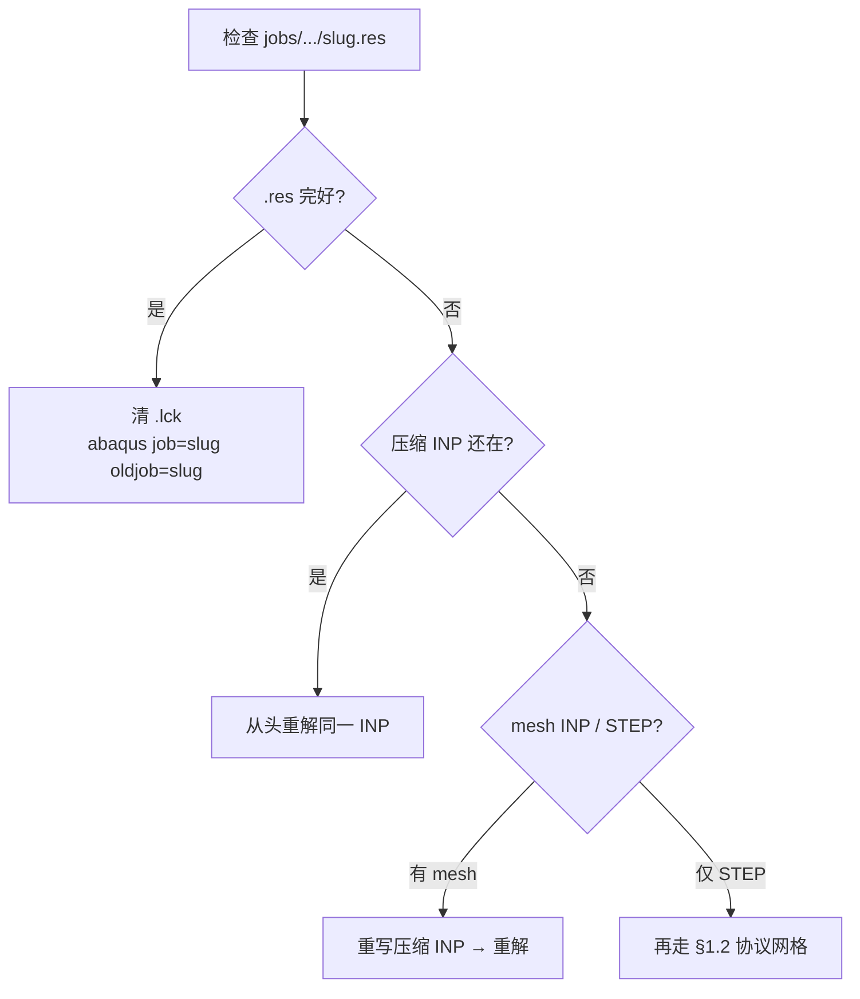

# param_batch CAE 仿真情况明细

- **核对基准时间**: `2026-09-22`（本机 `output/post/param_batch/…/*_stress_strain.csv` + `reports/param_batch/compare_cae_energy_v1/energy_metrics.csv` ≈09-21；服务器作业核对于 09-21）
- **协议**: 主对比统一标准（`BATCH_SIM_MESH_PROTOCOL=1`）；L=20 mm seed **0.6**；L=10 mm 相似缩放 seed **0.3**（另表，不与 0.6 主对比混排名）
- **run_slug**: `cae_tet0p6mm80_5mmin_paperbox`（L20）；`cae_tet0p3mm80_5mmin_paperbox`（L10）
- **服务器根（临时）**: `/home/art/HuBaiLab_ssd/`（旧机械盘 `/media/art/file/...` 已坏停用）
- **本机根**: `D:\HuBaiLab\`
- **当前结论**: 清单 **26** 案。L=20 主对比 **21/22** 可分析（20 complete + 1 near_complete）；协议网格仍失败 **1** 案 `af2q1_deq2_k2`。L=10：**3/4** 完成（缺 `af2q1_deq2_k2_L10`）
- **关联**: [`param_batch_STEP生成说明.md`](./param_batch_STEP生成说明.md) §7 · [`Abaqus_CAD实体压缩说明.md`](./Abaqus_CAD实体压缩说明.md) · [`Abaqus显式续算.md`](./Abaqus显式续算.md) · CAD 明细 [`param_batch_STEP生成情况明细.md`](./param_batch_STEP生成情况明细.md) · 吸能图 `output/reports/param_batch/` 与 `compare_cae_energy_v1/`

目录约定：

```text
output/export|jobs|post/param_batch/{case_id}/cae_tet0p6mm80_5mmin_paperbox/
```

---

## 1. 网格划分流程

体网格**只允许 CAE**；Gmsh **仅 heal STEP**，不进主线体网格。实现：`scripts/linux/run_param_batch_cae_sim_queue.sh`。

### 1.1 总览：协议档 vs 诊断梯子

本批主对比固定 `BATCH_SIM_MESH_PROTOCOL=1`（左支）。梯子（右支）仅诊断，**成功也不得混入主对比图**。



### 1.2 主对比协议档（`MESH_PROTOCOL=1`，本批实际路径）

**唯一 CAE 档**：seed **0.6** · quality **`fast`** · **Virtual Topology** · **C3D4** · `rods-per-diameter=3` · `rod-diameter=deq`。  
**禁止**为跑通而放大 seed 或换 quality。日志：`HEAL STEP` / `HEAL OK` / `CAE PROTOCOL`。



参数表：

| 步骤 | 设置 | 说明 |
|------|------|------|
| CAD 源 | `verified/batch_{case_id}_paper_box_array.step` | 由该案合格 `_444.step` 拷入 |
| STEP heal | Gmsh OCC；结构保持合验 | 超时默认 2400/900 s；产物 `verified/heal_{case_id}/` |
| heal 失败 | 回退 raw verified，仍走同一 CAE 档 | **不换** seed/quality |
| 单元 / seed / quality | C3D4 · **0.6 mm** · **`fast`** · **vtopo** | 历史：`lattice_contact`+vtopo 部分 Q≈1 久跑 0 单元 |
| rods-per-diameter | **3.0**；rod-diameter = **`deq`** | 见 §4 几何列 |
| 主对比禁止 | seed 0.8/1.0；换 lattice*；关 vtopo 凑合 | 梯子结果不得混画主图 |

### 1.3 诊断梯子（仅 `MESH_PROTOCOL≠1`）

策略：**优先保持 seed 0.6**（换 quality / vtopo / `seed-part-only` / `ignore-invalid`），**仅当 0.6 全败**才放大到 0.8 / 1.0。网格仍串行；梯子跑时仍可填满求解槽。对应 `mesh_ladder()`。

可选前置：若未设 `BATCH_SIM_SKIP_BASELINE=1`，先试 baseline 一体导出（seed0.6 · `lattice_contact` · vtopo）；失败再进梯子。本批主对比常用 `SKIP_BASELINE=1`，直接梯子——但 **`MESH_PROTOCOL=1` 时整段不启用**。



任一步成功即停止后续尝试并写 mesh INP；seed≥0.8 的成功须标为**非可比**。

---

## 2. 仿真设置与求解流程

### 2.1 统一求解参数

| 项 | 值 |
|----|-----|
| 几何族 | `paper_box`：扫掠管 + 虚拟 L³ 盒切割，无节点球；阵列 **4×4×4**，L=**20 mm**（块高 80 mm） |
| 工程应变 | **80%**（压下 64 mm / 80 mm） |
| 加载速率 | **5 mm/min**（压缩步长 ≈ 768 s） |
| 求解器 | Abaqus/**Explicit** |
| 时间增量 | dt 上限 **5×10⁻⁴ s**，`automatic` |
| 质量缩放 | `below_min` × **50** |
| 材料 | **Neo-Hooke**（CLI `paper`）：E=**25 MPa**，ν=**0.47**，ρ=**1135 kg/m³** |
| 自接触 | **STORE OFFSETS** + **ContactSettle**（15% 步长，s0=0.02）；μ=**0.1** |
| 每案资源 | **48 核 / 256 GB** |
| 并行策略 | CAE 网格 **串行**；Explicit 求解最多 **2 路**；压缩 INP 可后台导出 |
| 续算 | INP 含 `*Restart, write, overlay`；中断后可用 `oldjob=` + **`.res`**（见 [`Abaqus显式续算.md`](./Abaqus显式续算.md)） |

环境变量摘要：`BATCH_SIM_CPUS=48`、`BATCH_SIM_MEMORY_MB=262144`、`BATCH_SIM_MAX_PARALLEL=2`、`BATCH_SIM_MESH_PROTOCOL=1`、`BATCH_SIM_SKIP_BASELINE=1`。

### 2.2 队列内：网格 → 导出 → 求解



中断续跑（有 `.res` 时，见 [`Abaqus显式续算.md`](./Abaqus显式续算.md)）：



---

## 3. 状态图例

| 标记 | 含义 |
|------|------|
| ✓ 完成 | 本机有完整 `*_stress_strain.csv`（早期基线 ≈48 点；近期补齐案 ≈96 点）；`energy_metrics.status=complete` |
| ≈ 近完整 | CSV 已有且可进主对比讨论，但能量表所用曲线未压满协议 80%（`near_complete`；当前仅 `af2q1_deq2_k1p5`，主文件 ε≈0.75） |
| ▣/○ 待网格 | 尚未用协议档成功写出可比 INP，或计划 remesh |
| ✗ SKIP / HOLD | 协议 CAE **0 单元**等；不进主对比；需 **CAD 重融合**后再入队（禁止放大 seed 凑合） |
| — 未入队 | 清单有案但本轮未开网格/求解 |

权威进度以本机 `post/…/*_stress_strain.csv` 与 `compare_cae_energy_v1/energy_metrics.csv` 为准；旧「7 完成 / 2 中断」叙事已过时。

---

## 4. 逐案核对表（主对比 L=20，seed 0.6）

几何取自 `_batch_index.json`。进度核对：`2026-09-22`（CSV mtime + `energy_metrics.csv` ≈09-21）。

### 4.0 原 16 案

| 案 | Af | Q | deq | k | 网格处理 | 仿真阶段 | 本机 CSV | 备注 |
|----|----|---|-----|---|----------|----------|----------|------|
| `af2q0_deq2_k1` | 2 | 0 | 2.0 | 1 | 协议档已过（基线） | ✓ 完成 | 有（≈48，07-19） | 旧基线；**勿重网格**；Q=0 圆杆对照 |
| `af2q0p5_deq2_k1` | 2 | 0.5 | 2.0 | 1 | 同上 | ✓ 完成 | 有（≈48，07-19） | 旧基线；勿重网格；Wv 领先之一 |
| `af2q1p5_deq2_k1` | 2 | 1.5 | 2.0 | 1 | 同上 | ✓ 完成 | 有（≈48，07-19） | 旧基线；勿重网格 |
| `af2q0_deq2_k2` | 2 | 0 | 2.0 | 2 | 同上 | ✓ 完成 | 有（≈48，07-19） | 旧基线；勿重网格 |
| `af2q1p5_deq2_k2` | 2 | 1.5 | 2.0 | 2 | 同上 | ✓ 完成 | 有（≈48，07-19） | 旧基线；勿重网格 |
| `af2q0_deq2_k1p5` | 2 | 0 | 2.0 | 1.5 | 协议 heal→CAE | ✓ 完成 | 有（≈48，07-19） | FOCUS |
| `af3q1_deq2_k1` | 3 | 1 | 2.0 | 1 | 协议 heal→CAE | ✓ 完成 | 有（≈48，07-19） | FOCUS；Af=3 |
| `af2q1_deq2_k1` | 2 | 1 | 2.0 | 1 | 协议已过 | ✓ 完成 | 有（≈96，09-06） | 曾中断半截；现 `complete` |
| `af2q1_deq2_k1p5` | 2 | 1 | 2.0 | 1.5 | 协议已过 | ≈ 近完整 | 有（≈91，09-06） | 能量表 `near_complete`（ε≈0.75）；可进排名但注明 |
| `af2q0p5_deq2_k2` | 2 | 0.5 | 2.0 | 2 | 协议已过 | ✓ 完成 | 有（≈96，09-06） | 原 NEW3 待网格；已补齐 |
| `af2q1_deq1p5_k1` | 2 | 1 | 1.5 | 1 | 协议已过（本机） | ✓ 完成 | 有（≈96，09-03） | 细杆；CAD 08-04 恢复后本机重解完成 |
| `af1q1_deq2_k1` | 1 | 1 | 2.0 | 1 | 协议已过（重融合后） | ✓ 完成 | 有（≈96，09-03） | 原 0 单元 SKIP；CAD 重融合后已出完整曲线 |
| `af2q0p5_deq2_k1p5` | 2 | 0.5 | 2.0 | 1.5 | 协议已过 | ✓ 完成 | 有（≈48，09-13） | 原 HOLD；重融合后已完成 |
| `af2q1_deq2p5_k1` | 2 | 1 | 2.5 | 1 | 协议已过 | ✓ 完成 | 有（≈48，09-09） | 原 HOLD；粗杆；SEA 高 |
| `af2q1p5_deq2_k1p5` | 2 | 1.5 | 2.0 | 1.5 | 协议已过 | ✓ 完成 | 有（≈48，09-10） | 原 HOLD |
| `af2q1_deq2_k2` | 2 | 1 | 2.0 | 2 | ✗ 协议 FAIL（0 单元） | ✗ HOLD | 无 | **L20 唯一缺席**；09-21 服务器无 jobs/export/post |

### 4.0b Af 扩参（deq=2、k=1；09-13 起）

| 案 | Af | Q | 网格处理 | 仿真阶段 | 本机 CSV | 备注 |
|----|----|---|---------|----------|----------|------|
| `af0p5q1_deq2_k1` | 0.5 | 1 | 协议已过 | ✓ 完成 | 有（≈48，09-14） | Q=1 Af 扫参 |
| `af1p5q1_deq2_k1` | 1.5 | 1 | 协议已过 | ✓ 完成 | 有（≈48，09-14） | 同上 |
| `af2p5q1_deq2_k1` | 2.5 | 1 | 协议已过 | ✓ 完成 | 有（≈48，09-16） | 同上 |
| `af0p5q1p5_deq2_k1` | 0.5 | 1.5 | 协议已过 | ✓ 完成 | 有（≈48，09-18） | Q=1.5 Af 扫参 |
| `af1q1p5_deq2_k1` | 1 | 1.5 | 协议已过 | ✓ 完成 | 有（≈48，09-17） | 同上 |
| `af1p5q1p5_deq2_k1` | 1.5 | 1.5 | 协议已过 | ✓ 完成 | 有（≈96，09-21） | 服务器 09-19 求解成功；本机 09-21 从 `up.odb` 抽出曲线 |

### 4.1 汇总计数（L=20 主对比）

| 类别 | 数量 | 案 |
|------|------|-----|
| ✓ 完成（`complete`） | **20** | 原 16 案中除 k2 / k1p5 近完整外的全部 + 6 案 Af 扩参（含 `af1p5q1p5_deq2_k1`） |
| ≈ 近完整（`near_complete`） | **1** | `af2q1_deq2_k1p5` |
| ✗ HOLD（无协议网格 / 无 CSV） | **1** | `af2q1_deq2_k2` |
| ✗ CAD VOID | **0** | 细杆案 2026-08-04 已恢复 |
| **L=20 合计** | **22** | 原 16 + Af 扩参 6 |
| **可分析曲线** | **21** | 20 + 1；缺 k2 勿混入主对比排名 |

能量表 `energy_metrics.csv` 按整份 `generation_order`（26 行）写出时，4 案 L10 会显示 `missing`——那是 **slug 不是 0.6**，不是没做（见 §4.3）。

### 4.2 指标与图册（讨论用）

| 产物 | 路径 |
|------|------|
| 能量指标表 | `output/reports/param_batch/compare_cae_energy_v1/energy_metrics.csv`（刷新 ≈2026-09-21） |
| 能量图册 | `output/reports/param_batch/compare_cae_energy_v1/`（01–06 PNG） |
| Q=1.5 Af 扫参曲线 | `output/reports/param_batch/batch_cae_af_sweep_q1p5_stress_strain.png`（4/4） |
| 应力–应变对比图 | `output/reports/param_batch/batch_cae_stress_strain_compare.png` 等 |
| 场云图拼图 | `output/reports/param_batch/batch_cae_field_contours_collage.png`（L20 **21** 面板；无 k2 / 无 L10） |
| 参数汇总 | `output/reports/param_batch结构参数汇总.xlsx` |

趋势摘要（仅 complete/near_complete）：中等 Q（≈0.5～1）+ κ=1 利 Wv；细杆 deq=1.5 峰值应力低、效率高，SEA 最高的是更粗的 deq=2.5；κ↑ 往往更软。以 `param_batch` 吸能图与 09-21 能量表为准。

### 4.3 L=10 相似缩放（seed 0.3，不进 0.6 主排名）

几何为父案 0.5 倍（`L=10`，`deq=1`）。CSV 在 `output/post/param_batch/{id}/cae_tet0p3mm80_5mmin_paperbox/`。

| 案 | 父案 | 仿真阶段 | CSV | 备注 |
|----|------|----------|-----|------|
| `af2q0_deq2_k1_L10` | `af2q0_deq2_k1` | ✓ 完成 | 有（≈48，09-18） | |
| `af2q1_deq2_k1_L10` | `af2q1_deq2_k1` | ✓ 完成 | 有（≈48，09-18） | |
| `af2q1p5_deq2_k1_L10` | `af2q1p5_deq2_k1` | ✓ 完成 | 有（≈48，09-18） | 本机无 `*_qc.json` |
| `af2q1_deq2_k2_L10` | `af2q1_deq2_k2` | — 未入队 | 无 | 有 444 STEP；无 QC、无网格 |

尺寸效应图：`output/reports/param_batch/L10_vs_L20_size_effect_stress_strain.png`。

---

## 5. 产物与备份（核对用）

| 产物 | 服务器 | 本机 |
|------|--------|------|
| 压缩 INP / CAE mesh INP | `export/param_batch/{id}/{slug}/` | 部分在 `export/param_batch/` |
| ODB / `.sta` / **`.res`** | `jobs/param_batch/{id}/{slug}/` | 本机求解案在 `jobs/`；批量服案 `.res` 未必齐全 |
| 应力–应变 CSV | `post/param_batch/{id}/{slug}/` | L20：**20 完整 + 1 近完整**；L10 在 `post/param_batch/` 的 0.3 slug（见 §4） |
| 跳过 / HOLD | `_batch_sim_skipped.json`（`export/param_batch/`） | 文首时间戳可能落后于磁盘；以无 CSV 的 `af2q1_deq2_k2` 为准 |
| 对比 / 能量图 | `output/reports/param_batch/` | 含 `compare_cae_energy_v1/`（09-21 刷新） |

**HOLD 一案下一步**（`af2q1_deq2_k2`）：勿换 seed/quality 进主对比；先 CAD 重融合（face-mate + `noclip_batch64` 等锁定梯子）→ verified → §1.2 协议网格 → 再求解。`af2q1_deq2_k2_L10` 随父案网格打通后再入队 0.3 协议。

---

## 6. 本机跑批与服务器协议对齐（可比性）

服务器不可用时，本机统一走：

```powershell
powershell -File scripts/run_param_batch_cae_mesh_local.ps1
# 或单案：
powershell -File scripts/run_param_batch_cae_mesh_local.ps1 -Only af2q1_deq2_k2
```

**与服务器 `BATCH_SIM_MESH_PROTOCOL=1` 锁定一致（默认禁止改档）：**

| 步骤 | 本机 | 服务器 |
|------|------|--------|
| CAD | 本机 `*_444.step` ↔ `verified/batch_*`（脚本会按 size 同步） | 同路径 |
| heal | `step_heal_for_cae` v3 + `BATCH_HEAL_OCP_PREREPAIR=1` | 同 |
| CAE | seed **0.6** · **`fast`** · **vtopo** · C3D4 · rods/diam=3 · rod=`deq` | 同 |
| 压缩 INP | 80% · 5 mm/min · paper · STORE OFFSETS · ContactSettle 0.15/s0=0.02 · dt=5e-4 | 同 `export_from_mesh` |
| slug | `cae_tet0p6mm80_5mmin_paperbox` | 同 |

本机一键对齐服务器队列（自动挑案 / SKIP 协议失败 / 串行网格→导出→可选求解）：

```powershell
powershell -File scripts/run_param_batch_cae_sim_local.ps1              # 网格+导出+求解
powershell -File scripts/run_param_batch_cae_sim_local.ps1 -ExportOnly   # 仅网格+导出
```

仅网格脚本：`run_param_batch_cae_mesh_local.ps1`。每案写出 `protocol_local_manifest.json` 备核。  
非协议试跑须显式 `-AllowNonProtocol`（**不得**混入主对比）。

**说明：** 网格与 INP 设置对齐后，主对比曲线可比；Explicit 若本机核数/内存与服务器不同，数值可能有微小差异，但工况定义相同。本机求解默认 6 核 / 10 GB（笔记本），与网格协议无关。

监控：`powershell -File scripts/watch_param_batch_cae_mesh_local.ps1 -CaseId <id>`
日志：`output/logs/param_batch_cae_sim_local.log`

---

## 6.1 场云图批量导出（S.Mises）

不必逐个打开 ODB。默认**每个结构 3 张图**（开始压缩 / 压缩中期 / 致密化），统一视角：

- **Z 朝上**，**Y 朝右**，**+X 朝向观察者**（`zup`）
- 帧：步时间约 **0% / 45% / 80%** → 文件名 `start` / `mid` / `densify`

本机 ODB 很大（数 GB～十余 GB），**不要一次开全部案**。脚本默认：`abaqus viewer`、1280×960、**每次只导 1 案**、导完暂停 30 s 放内存、已完成的自动跳过。

```powershell
# 一次只导 1 个未完成案（崩过之后用这个续跑）
powershell -File scripts/run_param_batch_field_contours.ps1

# 指定单案
powershell -File scripts/run_param_batch_field_contours.ps1 -Only af2q1_deq2_k1
```

| 产物 | 路径 |
|------|------|
| 每结构独立文件夹（仅 3 图 + 拼图） | `output/reports/param_batch/field_contours/{case_id}/` |
| 中文镜像 | `output/reports/param_batch/field_contours/{case_id}/` |

致密化帧比例可改：`-Fractions 0,0.5,0.85`（配合 `-StageTags start,mid,densify`）。加 LE：`-Fields mises,le`。

---

## 7. 变更记录

| 时间 | 事项 |
|------|------|
| 2026-07-16～ | 批量 CAE 队列启动；基线案陆续完成 |
| 2026-07-19 | FOCUS 完成 2；2 案求解中断待续；2 案 SKIP；remain2/NEW3 待网格 |
| 2026-07-20 | 本文建立：网格协议、仿真设置、流程图与逐案状态 |
| 2026-07-20 | 本机 `run_param_batch_cae_mesh_local.ps1` 锁定与服务器协议一致（heal→CAE→export） |
| 2026-07-28 | `af2q1_deq1p5_k1` CAD 作废（单胞不合格）；删 STEP；写入 `_batch_sim_skipped.json`；旧 mesh/半截求解不入主对比 |
| 2026-08-04 | `af2q1_deq1p5_k1` CAD 恢复（face-mate+noclip QC ok）；CAE 仍待重新 verified→协议网格；旧 VOID 产物勿续 |
| 2026-08-04 | `af2q1_deq1p5_k1` 本机协议网格通过：heal→CAE seed0.6（~75.8万 C3D4）→压缩 INP；待提交 Explicit |
| 2026-09-03 | `af1q1_deq2_k1`、`af2q1_deq1p5_k1` 本机出完整应力–应变 CSV（≈96 点） |
| 2026-09-06 | `af2q0p5_deq2_k2`、`af2q1_deq2_k1` 补齐 complete；`af2q1_deq2_k1p5` 近完整（≈91 点） |
| 2026-09-07 | 能量图册 / `energy_metrics.csv` 刷新；CAD `_batch_status` 维护 |
| 2026-09-08 | 当时进度表：可分析 **12/16**；HOLD 四案（其后三案已补齐，见下） |
| 2026-09-09 | `af2q1_deq2p5_k1` 协议压缩完成（原 HOLD） |
| 2026-09-10 | `af2q1p5_deq2_k1p5` 协议压缩完成（原 HOLD） |
| 2026-09-13 | `af2q0p5_deq2_k1p5` 协议压缩完成（原 HOLD） |
| 2026-09-13～16 | Af 扫参 CAD+CAE：Q=1 的 `af0p5` / `af1p5` / `af2p5` |
| 2026-09-14 | 新增场云图批量导出：`run_param_batch_field_contours.ps1` / `export_odb_field_contours_cae.py`（§6.1） |
| 2026-09-16～18 | L10 相似缩放 3 案 seed0.3 完成；Q=1.5 Af 扫参 `af0p5` / `af1` 完成 |
| 2026-09-19 | 服务器 `af1p5q1p5_deq2_k1` Explicit **COMPLETED** |
| 2026-09-21 | 本机对该案 `up.odb` 抽出 96 点 CSV；刷新能量图册与 Q=1.5 Af 扫参图；核服务器确认 `af2q1_deq2_k2` **仍无作业** |
| 2026-09-22 | **本文对齐磁盘**：L20 可分析 **21/22**；HOLD 仅 `af2q1_deq2_k2`；L10 **3/4** |
