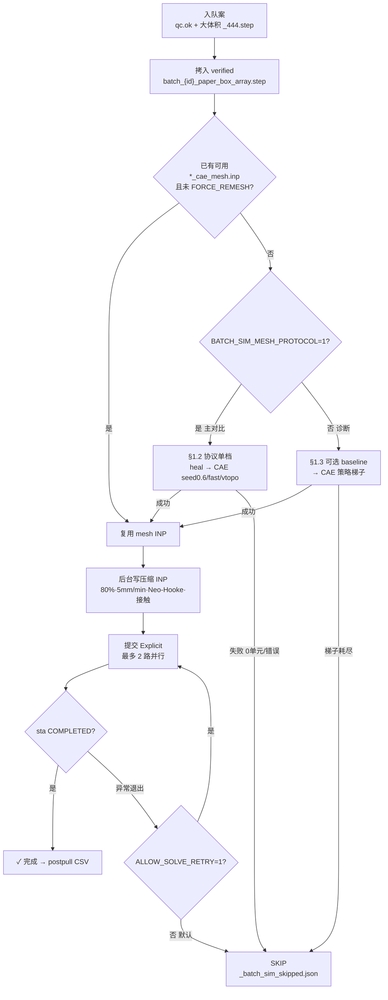
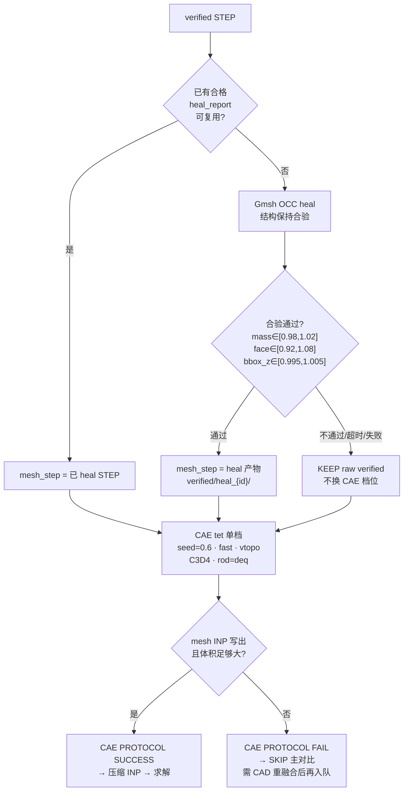
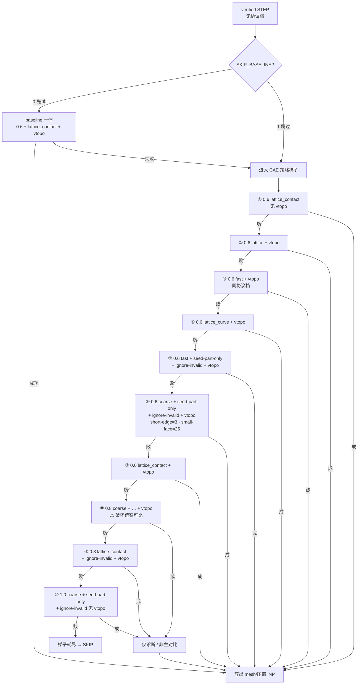
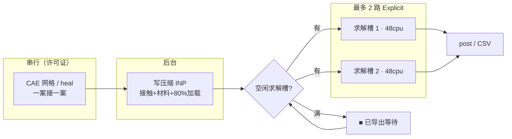
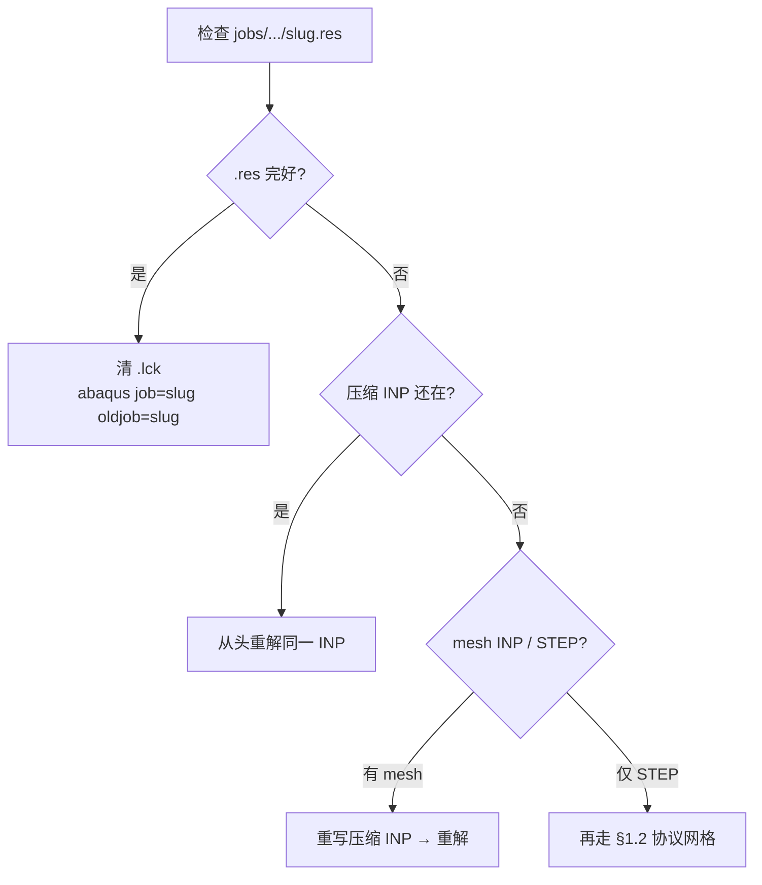

# 批量构型 CAE 仿真情况明细

- **核对基准时间**: `2026-07-20`（进度快照：**2026-07-19 ≈17:12**）
- **协议**: 主对比统一标准（`BATCH_SIM_MESH_PROTOCOL=1`）
- **run_slug**: `cae_tet0p6mm80_5mmin_paperbox`
- **服务器根**: `/media/art/file/XiangLang/Lattice/LWY/HuBaiLab/`
- **本机根**: `D:\HuBaiLab\`
- **关联**: [`批量构型STEP生成说明.md`](./批量构型STEP生成说明.md) §7 · [`Abaqus_CAD实体压缩说明.md`](./Abaqus_CAD实体压缩说明.md) · [`Abaqus显式续算.md`](./Abaqus显式续算.md) · CAD 明细 [`批量构型STEP生成情况明细.md`](./批量构型STEP生成情况明细.md)

目录约定：

```text
output/export|jobs|post/批量构型/{case_id}/cae_tet0p6mm80_5mmin_paperbox/
```

---

## 1. 网格划分流程

体网格**只允许 CAE**；Gmsh **仅 heal STEP**，不进主线体网格。实现：`scripts/linux/run_param_batch_cae_sim_queue.sh`。

### 1.1 总览：协议档 vs 诊断梯子

本批主对比固定 `BATCH_SIM_MESH_PROTOCOL=1`（左支）。梯子（右支）仅诊断，**成功也不得混入主对比图**。



### 1.2 主对比协议档（`MESH_PROTOCOL=1`，本批实际路径）

**唯一 CAE 档**：seed **0.6** · quality **`fast`** · **Virtual Topology** · **C3D4** · `rods-per-diameter=3` · `rod-diameter=deq`。  
**禁止**为跑通而放大 seed 或换 quality。日志：`HEAL STEP` / `HEAL OK` / `CAE PROTOCOL`。



参数表：

| 步骤 | 设置 | 说明 |
|------|------|------|
| CAD 源 | `verified/batch_{case_id}_paper_box_array.step` | 由该案合格 `_444.step` 拷入 |
| STEP heal | Gmsh OCC；结构保持合验 | 超时默认 2400/900 s；产物 `verified/heal_{case_id}/` |
| heal 失败 | 回退 raw verified，仍走同一 CAE 档 | **不换** seed/quality |
| 单元 / seed / quality | C3D4 · **0.6 mm** · **`fast`** · **vtopo** | 历史：`lattice_contact`+vtopo 部分 Q≈1 久跑 0 单元 |
| rods-per-diameter | **3.0**；rod-diameter = **`deq`** | 见 §4 几何列 |
| 主对比禁止 | seed 0.8/1.0；换 lattice*；关 vtopo 凑合 | 梯子结果不得混画主图 |

### 1.3 诊断梯子（仅 `MESH_PROTOCOL≠1`）

策略：**优先保持 seed 0.6**（换 quality / vtopo / `seed-part-only` / `ignore-invalid`），**仅当 0.6 全败**才放大到 0.8 / 1.0。网格仍串行；梯子跑时仍可填满求解槽。对应 `mesh_ladder()`。

可选前置：若未设 `BATCH_SIM_SKIP_BASELINE=1`，先试 baseline 一体导出（seed0.6 · `lattice_contact` · vtopo）；失败再进梯子。本批主对比常用 `SKIP_BASELINE=1`，直接梯子——但 **`MESH_PROTOCOL=1` 时整段不启用**。



任一步成功即停止后续尝试并写 mesh INP；seed≥0.8 的成功须标为**非可比**。

---

## 2. 仿真设置与求解流程

### 2.1 统一求解参数

| 项 | 值 |
|----|-----|
| 几何族 | `paper_box`：扫掠管 + 虚拟 L³ 盒切割，无节点球；阵列 **4×4×4**，L=**20 mm**（块高 80 mm） |
| 工程应变 | **80%**（压下 64 mm / 80 mm） |
| 加载速率 | **5 mm/min**（压缩步长 ≈ 768 s） |
| 求解器 | Abaqus/**Explicit** |
| 时间增量 | dt 上限 **5×10⁻⁴ s**，`automatic` |
| 质量缩放 | `below_min` × **50** |
| 材料 | **Neo-Hooke**（CLI `paper`）：E=**25 MPa**，ν=**0.47**，ρ=**1135 kg/m³** |
| 自接触 | **STORE OFFSETS** + **ContactSettle**（15% 步长，s0=0.02）；μ=**0.1** |
| 每案资源 | **48 核 / 256 GB** |
| 并行策略 | CAE 网格 **串行**；Explicit 求解最多 **2 路**；压缩 INP 可后台导出 |
| 续算 | INP 含 `*Restart, write, overlay`；中断后可用 `oldjob=` + **`.res`**（见 [`Abaqus显式续算.md`](./Abaqus显式续算.md)） |

环境变量摘要：`BATCH_SIM_CPUS=48`、`BATCH_SIM_MEMORY_MB=262144`、`BATCH_SIM_MAX_PARALLEL=2`、`BATCH_SIM_MESH_PROTOCOL=1`、`BATCH_SIM_SKIP_BASELINE=1`。

### 2.2 队列内：网格 → 导出 → 求解



中断续跑（有 `.res` 时，见 [`Abaqus显式续算.md`](./Abaqus显式续算.md)）：



---

## 3. 状态图例

| 标记 | 含义 |
|------|------|
| ✓ 完成 | `.sta` COMPLETED；本机通常有完整 `*_stress_strain.csv`（≈49 行量级） |
| ▶ 中断待续 | Explicit 曾中断；**有 `.res` 则可续**，否则须重解 |
| ▣/○ 待网格 | 尚未用协议档成功写出可比 INP，或计划 remesh |
| ✗ SKIP | 协议 CAE **0 单元**等；不进主对比；需 CAD 重融合后再入队 |
| — 未入队 | 清单有案但本轮未开网格/求解 |

---

## 4. 逐案核对表（主对比）

几何取自 `_batch_index.json`。进度：2026-07-19 快照 + 本机 `output/post/批量构型/…/cae_tet0p6mm80_5mmin_paperbox/*_stress_strain.csv`。

| 案 | Af | Q | deq | k | 网格处理 | 仿真阶段 | 本机 CSV | 备注 |
|----|----|---|-----|---|----------|----------|----------|------|
| `af2q0_deq2_k1` | 2 | 0 | 2.0 | 1 | 协议档已过（基线） | ✓ 完成 | 有（完整） | 旧基线 5 之一；**勿重网格** |
| `af2q0p5_deq2_k1` | 2 | 0.5 | 2.0 | 1 | 同上 | ✓ 完成 | 有（完整） | 旧基线；勿重网格 |
| `af2q1p5_deq2_k1` | 2 | 1.5 | 2.0 | 1 | 同上 | ✓ 完成 | 有（完整） | 旧基线；勿重网格 |
| `af2q0_deq2_k2` | 2 | 0 | 2.0 | 2 | 同上 | ✓ 完成 | 有（完整） | 旧基线；勿重网格 |
| `af2q1p5_deq2_k2` | 2 | 1.5 | 2.0 | 2 | 同上 | ✓ 完成 | 有（完整） | 旧基线；勿重网格 |
| `af2q0_deq2_k1p5` | 2 | 0 | 2.0 | 1.5 | 协议 heal→CAE | ✓ 完成 | 有（完整） | FOCUS；盘前已完 |
| `af3q1_deq2_k1` | 3 | 1 | 2.0 | 1 | 协议 heal→CAE | ✓ 完成 | 有（完整） | FOCUS；盘前已完 |
| `af2q1_deq2_k1` | 2 | 1 | 2.0 | 1 | 协议已过、已提交 | ▶ 中断待续 | 有（半截） | 计划 `oldjob` 续跑；需服上 `.res` |
| `af2q1_deq2_k1p5` | 2 | 1 | 2.0 | 1.5 | 协议已过、已提交 | ▶ 中断待续 | 有（半截） | 同上 |
| `af2q1_deq2_k2` | 2 | 1 | 2.0 | 2 | ○ 待重网格 | — | 无 | remain2；盘恢复后入队 |
| `af2q1p5_deq2_k1p5` | 2 | 1.5 | 2.0 | 1.5 | ○ 待重网格 | — | 无 | remain2 |
| `af2q0p5_deq2_k2` | 2 | 0.5 | 2.0 | 2 | ○ 待网格（NEW3） | — | 无 | `param_batch_new3` |
| `af2q1_deq1p5_k1` | 2 | 1 | 1.5 | 1 | ✗ CAD VOID | ✗ 作废 | 无 | 2026-07-28 单胞不合格；STEP 已删；旧协议网格/半截求解勿续、勿入主对比 |
| `af2q1_deq2p5_k1` | 2 | 1 | 2.5 | 1 | ○ 待网格（NEW3） | — | 无 | deq=2.5 |
| `af1q1_deq2_k1` | 1 | 1 | 2.0 | 1 | ✗ 协议 FAIL（0 单元） | ✗ SKIP | 无 | ~16:16；需 CAD 重融合 |
| `af2q0p5_deq2_k1p5` | 2 | 0.5 | 2.0 | 1.5 | ✗ 协议 FAIL（0 单元） | ✗ SKIP | 无 | 同因；需 CAD 重融合 |

### 4.1 汇总计数

| 类别 | 数量 | 案 |
|------|------|-----|
| ✓ 完成（本机有完整 CSV） | **7** | `af2q0_deq2_k1` · `af2q0p5_deq2_k1` · `af2q1p5_deq2_k1` · `af2q0_deq2_k2` · `af2q1p5_deq2_k2` · `af2q0_deq2_k1p5` · `af3q1_deq2_k1` |
| ▶ 求解中断、待续 | **2** | `af2q1_deq2_k1` · `af2q1_deq2_k1p5` |
| ○ 待网格 / 待重网格 | **4** | `af2q1_deq2_k2` · `af2q1p5_deq2_k1p5` · `af2q0p5_deq2_k2` · `af2q1_deq2p5_k1` |
| ✗ 网格 SKIP | **2** | `af1q1_deq2_k1` · `af2q0p5_deq2_k1p5` |
| ✗ CAD VOID | **1** | `af2q1_deq1p5_k1`（2026-07-28；单胞不合格，STEP 已删） |
| **清单合计** | **16** | 与 `_batch_index.json` 一致 |

---

## 5. 产物与备份（核对用）

| 产物 | 服务器 | 本机 |
|------|--------|------|
| 压缩 INP / CAE mesh INP | `export/批量构型/{id}/{slug}/` | 批量案多不完整 |
| ODB / `.sta` / **`.res`** | `jobs/批量构型/{id}/{slug}/` | 批量案 **无 `.res` 备份** |
| 应力–应变 CSV | `post/批量构型/{id}/{slug}/` | **7 完整 + 2 半截**（见 §4） |
| 跳过记录 | `_batch_sim_skipped.json` | 同步后可核 |
| 对比图 | `output/reports/…` | 有部分 `batch_cae_*` 图 |

**续跑条件（两案 ▶）**：检查  
`jobs/批量构型/{cid}/cae_tet0p6mm80_5mmin_paperbox/cae_tet0p6mm80_5mmin_paperbox.res`  
存在且完好 → `abaqus job=… oldjob=…`；否则只能重解（INP 在则免重网格）。详见 [`Abaqus显式续算.md`](./Abaqus显式续算.md)。

---

## 6. 本机跑批与服务器协议对齐（可比性）

服务器不可用时，本机统一走：

```powershell
powershell -File scripts/run_param_batch_cae_mesh_local.ps1
# 或单案：
powershell -File scripts/run_param_batch_cae_mesh_local.ps1 -Only af2q1_deq2_k2
```

**与服务器 `BATCH_SIM_MESH_PROTOCOL=1` 锁定一致（默认禁止改档）：**

| 步骤 | 本机 | 服务器 |
|------|------|--------|
| CAD | 本机 `*_444.step` ↔ `verified/batch_*`（脚本会按 size 同步） | 同路径 |
| heal | `step_heal_for_cae` v3 + `BATCH_HEAL_OCP_PREREPAIR=1` | 同 |
| CAE | seed **0.6** · **`fast`** · **vtopo** · C3D4 · rods/diam=3 · rod=`deq` | 同 |
| 压缩 INP | 80% · 5 mm/min · paper · STORE OFFSETS · ContactSettle 0.15/s0=0.02 · dt=5e-4 | 同 `export_from_mesh` |
| slug | `cae_tet0p6mm80_5mmin_paperbox` | 同 |

本机一键对齐服务器队列（自动挑案 / SKIP 协议失败 / 串行网格→导出→可选求解）：

```powershell
powershell -File scripts/run_param_batch_cae_sim_local.ps1              # 网格+导出+求解
powershell -File scripts/run_param_batch_cae_sim_local.ps1 -ExportOnly   # 仅网格+导出
```

仅网格脚本：`run_param_batch_cae_mesh_local.ps1`。每案写出 `protocol_local_manifest.json` 备核。  
非协议试跑须显式 `-AllowNonProtocol`（**不得**混入主对比）。

**说明：** 网格与 INP 设置对齐后，主对比曲线可比；Explicit 若本机核数/内存与服务器不同，数值可能有微小差异，但工况定义相同。本机求解默认 6 核 / 10 GB（笔记本），与网格协议无关。

监控：`powershell -File scripts/watch_param_batch_cae_mesh_local.ps1 -CaseId <id>`
日志：`output/logs/param_batch_cae_sim_local.log`

---

## 7. 变更记录

| 时间 | 事项 |
|------|------|
| 2026-07-16～ | 批量 CAE 队列启动；基线案陆续完成 |
| 2026-07-19 | FOCUS 完成 2；2 案求解中断待续；2 案 SKIP；remain2/NEW3 待网格 |
| 2026-07-20 | 本文建立：网格协议、仿真设置、流程图与逐案状态 |
| 2026-07-20 | 本机 `run_param_batch_cae_mesh_local.ps1` 锁定与服务器协议一致（heal→CAE→export） |
| 2026-07-28 | `af2q1_deq1p5_k1` CAD 作废（单胞不合格）；删 STEP；写入 `_batch_sim_skipped.json`；旧 mesh/半截求解不入主对比 |
